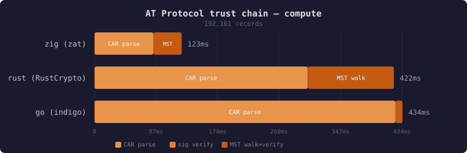

# three-way trust chain verification

the previous devlogs covered decode throughput and signature verification as isolated benchmarks. this one puts it all together: given a handle, resolve identity, fetch the full repo, and cryptographically verify everything — zig vs Go vs Rust.

## what we're measuring

the full AT Protocol trust chain:

```
handle → DID → DID document → signing key
                                    ↓
repo CAR → commit → signature ← verified against key
                ↓
         MST root CID → walk nodes → rebuild tree → CID match
```

all three implementations do the same work: resolve the handle, resolve the DID, extract the signing key, fetch the repo CAR, parse every block with SHA-256 CID verification, verify the commit signature, walk the MST to count records, and (where possible) rebuild the MST to verify the root CID.

## the implementations

**zig (zat)** — uses zat's own primitives end to end: `HandleResolver`, `DidResolver`, `car.read()` with CID verification, `jwt.verifySecp256k1`, `mst.Mst` for walk + rebuild.

**go (indigo)** — uses bluesky's official Go SDK: `identity.BaseDirectory` for handle/DID resolution, `repo.LoadRepoFromCAR` for parsing, `commit.VerifySignature` for sig verify, `MST.Walk()` + `MST.RootCID()` for MST.

**rust (RustCrypto)** — manual implementation since no indigo-equivalent exists in Rust. HTTP + DNS TXT handle resolution, plc.directory DID resolution, hand-rolled CAR parser with SHA-256, k256/p256 for ECDSA, recursive CBOR MST traversal. skips MST rebuild (no crate for it).

## the O(n) bug

first run against pfrazee.com (192k records, 243k blocks): zig's MST walk took **79 seconds**. go finished in 6ms.

the cause: `findBlock()` was doing a linear scan through 243k blocks on every lookup. MST walk calls `findBlock()` once per node (~50k nodes). that's ~12 billion comparisons.

Go's `TinyBlockstore` uses a `map[string]blocks.Block` — O(1) by CID key. replaced the flat block slice with `std.StringHashMapUnmanaged([]const u8)` in zig and `HashMap<Vec<u8>, Vec<u8>>` in rust.

result: 79s → 48ms (zig), 14s → 125ms (rust).

## results

_pfrazee.com — 192,144 records, 243,470 blocks, 70.6 MB CAR, macOS arm64 (M3 Max)_



| SDK | CAR parse | sig verify | MST walk | MST rebuild | compute total |
|-----|----------:|----------:|---------:|------------:|-------------:|
| zig (zat) | 81.6ms | 0.6ms | 45.5ms | 172.6ms | **300.4ms** |
| go (indigo) | 403.8ms | 0.4ms | 5.8ms | 0.0ms | **410.0ms** |
| rust (RustCrypto) | 301.0ms | 0.2ms | 120.9ms | N/A | **422.1ms** |

network time (handle + DID resolution + repo fetch) dominates total wall clock — 8-20 seconds depending on PDS response time. compute is under 500ms for all three.

the story is different from the decode benchmarks. there, zig was 19x faster than Go. here, the gap is ~1.4x. the reason: signature verification is a single ECDSA verify (sub-millisecond for everyone), and CAR parsing on a 70 MB file is less dominated by per-block overhead than the firehose's thousands of small CARs. the MST rebuild (zig-only) is the biggest single cost — serializing 192k entries into a fresh tree and hashing.

go's MST walk is fastest (5.8ms vs zig's 45.5ms) because indigo's `LoadRepoFromCAR` builds the MST in memory during CAR parse. walking it is just pointer chasing. zig and rust decode MST nodes from raw CBOR on each visit.

## the chart tool

added a script (`scripts/verify_chart.py`) that parses `just verify` output and generates SVG charts — stacked horizontal bars with a dark theme. two variants: compute-only (the interesting comparison) and total (dominated by network). see the [atproto-bench README](https://tangled.sh/@zzstoatzz.io/atproto-bench) for the charts.

```sh
just chart pfrazee.com    # run verify + generate SVGs
```

## what's in this release

- **go-verify**: full trust chain verification using indigo
- **rust-verify**: full trust chain verification using RustCrypto + hand-rolled CAR/MST
- **zig verify**: O(1) block lookup fix (HashMap instead of linear scan)
- **scripts/verify_chart.py**: SVG chart generation from verify output
- **justfile**: `just verify`, `just chart` recipes
